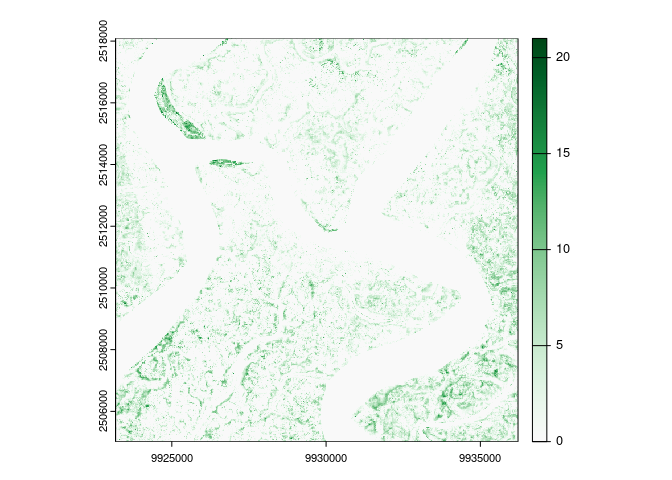

<!-- README.md is generated from README.Rmd. Please edit that file -->

# chmloader

<!-- badges: start -->

[](https://lifecycle.r-lib.org/articles/stages.html#experimental)
[](https://github.com/Permian-Global-Research/chmloader/actions/workflows/R-CMD-check.yaml)
<!-- badges: end -->

The goal of chmloader is to download the Canopy Height Model (CHM) data
from this recent work by [Tolan et
al. (2023)](https://www.sciencedirect.com/science/article/pii/S003442572300439X).
A high level summary of this work can be found
[here](https://sustainability.fb.com/blog/2024/04/22/using-artificial-intelligence-to-map-the-earths-forests/).
The data is downloaded from aws s3 storage - further details on the
bucket can be found
[here](https://registry.opendata.aws/dataforgood-fb-forests/)

## Installation

You can install the development version of chmloader like so:

``` r
# install.packages("pak")
pak::pkg_install("Permian-Global-Research/chmloader")
```

## Example

This is a basic example which shows you how to download some data:

``` r
library(chmloader)

sundarbans <- sf::st_point(c(89.2, 22.0)) |>
  sf::st_sfc(crs = 4326) |>
  sf::st_buffer(5000)

sundarbans_chm <- download_chm(sundarbans, filename = "sundarbans_chm.tif")
#> Warning: ! target is in longlat, transforming to EPSG:3857

sdb_chm <- terra::rast(sundarbans_chm)
terra::plot(sdb_chm,
  col = hcl.colors(256, "Dark Mint", rev = TRUE)
)
```



This package has only the one exported function `download_chm` which
downloads the CHM data from s3 bucket. The function takes an `sf` object
as input and returns a character vector for the output raster file path.
The download uses [gdalwarp](https://gdal.org/programs/gdalwarp.html)
(via
[`sf::gdal_utils`](https://r-spatial.github.io/sf/reference/gdal_utils.html))
to efficiently retrieve only the required data from across multiple
tiles - the default resolution is 1 m but this can be reprojected on the
fly as needed using the `res` argument.
