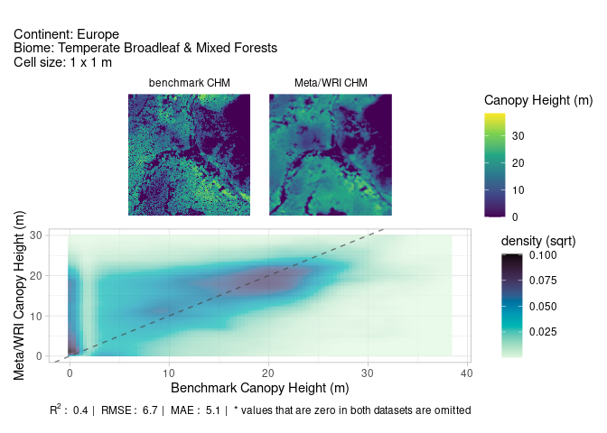

<!-- README.md is generated from README.Rmd. Please edit that file -->

# chmloader

<!-- badges: start -->

[](https://lifecycle.r-lib.org/articles/stages.html#experimental)
[](https://github.com/Permian-Global-Research/chmloader/actions/workflows/R-CMD-check.yaml)
[](https://app.codecov.io/gh/TESS-Laboratory/chmloader?branch=main)
[](https://opensource.org/license/apache-2-0)
<!-- badges: end -->

The goal of chmloader is to download the Canopy Height Model (CHM) data
from this recent work by [Tolan et
al. (2024)](https://www.sciencedirect.com/science/article/pii/S003442572300439X).
A high-level summary of this work can be found
[here](https://sustainability.fb.com/blog/2024/04/22/using-artificial-intelligence-to-map-the-earths-forests/).
The data is downloaded from AWS s3 storage - further details on the
bucket can be found
[here](https://registry.opendata.aws/dataforgood-fb-forests/)

## Installation

You can install chmloader like so:

``` r
# install.packages("pak")
pak::pkg_install("TESS-Laboratory/chmloader")
```

## Example

This is a basic example which shows you how to download some data. The
`download_chm` function uses
[gdalwarp](https://gdal.org/programs/gdalwarp.html) (via
[`sf::gdal_utils`](https://r-spatial.github.io/sf/reference/gdal_utils.html))
to efficiently retrieve only the required data from multiple tiles - the
default resolution is 1 m but this can be reprojected as needed using
the `res` argument.

``` r
library(chmloader)

parana_cuiana <- sf::st_point(c(-61.89, -4.12)) |>
  sf::st_sfc(crs = 4326) |>
  sf::st_buffer(3000)

pc_chm <- download_chm(
  parana_cuiana,
  filename = tempfile(fileext = ".tif")
)
terra::plot(pc_chm, col = hcl.colors(256, "viridis"))
```


This package also provides a simple function to create plots for
comparing different CHMs. The intention of this function is to enable
simple and robust evaluation of the Tolan et al. (2024) CHM data with
LiDAR-based models and other ML-derived products. The chmloader package
comes with a small set of LiDAR-based CHM example datasets, derived from
the English Environment Agency’s [Vegetation Object Model
dataset](https://www.data.gov.uk/dataset/227ab487-e8f2-4cbb-b26a-9e6d3b662265/lidar-vegetation-object-model-vom)
Below is an example using one of these example datasets from Fingle
Woods, Devon, UK:

``` r
fingle_woods <- reference_data("fingle_woods")

compare_models(fingle_woods, aggregate = 10, drop_zeros = TRUE)
#> ℹ meta/WRI CHM not provided, downloading now...
#> ✔ CHM downloaded successfully!
```



Note in this example, the `aggregate` argument is used to reduce the
resolution of both the reference and Meta/WRI CHM by a factor of 10
(resulting in a 10 m model) and test both this coarser scale model in
addition to the original 1 m model. This functionality may help to
reveal what the true resolution of the Meta/WRI CHM is, and how it
compares to the LiDAR-based model across scales.

Also, the `drop_zeros` argument is used to remove zero values from the
both the 2d density plot and the derived statistics, where values from
the reference/benchmark data and the Meta/WRI CHM are both zero. This is
particularly useful where the main interest is to evaluate the tree
canopy rather than the absence of trees and/or where tree cover is
sparse; however, the default `drop_zeros` value is `FALSE`.
